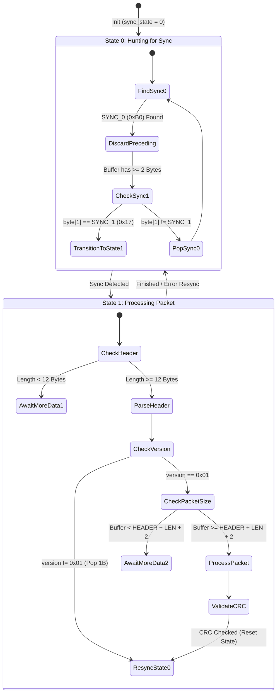

# Telemetry Receiver Logic — Technical Specification

The `receiver.py` script serves as the ground station terminal, receiving, unpacking, validating, and displaying telemetry packets from either a live TCP stream or an offline PCAP file. It utilizes a state machine to guarantee robust framing recovery over stream-oriented channels.

---

## 1. Concurrency and Client Loop

The receiver uses `asyncio` to coordinate socket data reads and dashboard rendering tasks:
1. **Network Input Task**: Establishes a TCP client connection via `asyncio.open_connection()`. It loops continuously, reading up to 4096-byte chunks from the network socket and appending them to an internal `bytearray` buffer.
2. **Dashboard Render Task**: If `--dashboard` is enabled, a concurrent loop clears the terminal screen every 1.0 seconds and prints a formatted summary (ASCII bar charts) representing the packet rates of the preceding second.

---

## 2. Synchronization State Machine

Because TCP is a stream-oriented protocol, data packets can arrive fragmented or merged. The receiver implements a two-state machine in `process_telemetry_buffer()` to recover valid packets.

### State 0: Hunting for Sync
- The buffer is scanned for `SYNC_0` (`0xB0`). Preceding garbage bytes are discarded.
- If `SYNC_0` is found and the buffer has at least 2 bytes, it checks the next byte.
- If `byte[1] == SYNC_1` (`0x17`), the machine locks synchronization and transitions to **State 1**.
- If not, `SYNC_0` is popped from the front of the buffer, and the search resumes.

### State 1: Reading Frame
- The machine checks if the buffer holds at least the **12-byte header**. If not, it halts processing and yields to wait for more network data.
- The 12-byte header is unpacked (`<BBBBBBHI`).
- The `version` byte is checked against `0x01`. If it mismatch, it is flagged, the first byte is popped from the buffer, and the machine drops back to **State 0** (Hunting) to avoid cascading framing alignment issues.
- The total expected frame size is calculated: `12` (header) + `payload_length` + `2` (CRC).
- If the buffer does not yet contain this number of bytes, the loop yields.
- Once the complete frame is in the buffer, it is sliced out, removed from the stream buffer, and routed to the validation stage. The machine resets back to **State 0**.

---

## 3. Data Integrity Validation

Once a packet is framed:
1. **CRC Calculation**: The receiver calculates a CRC-16-CCITT checksum over the packet segment starting at index 2 (from `version` to the end of the payload data, excluding the sync bytes).
2. **CRC Verification**: The last 2 bytes of the sliced packet are unpacked as a Big-Endian `uint16_t` and compared to the calculated CRC.
3. **Action on Match**:
   - **Match**: The packet is counted as valid. If in dashboard mode, the packet type is added to the count dictionary. Otherwise, packet metadata is printed.
   - **Mismatch**: The packet is marked as a CRC error and dropped. The receiver logs the warning and continues scanning. No socket crash or buffer reset occurs, allowing the stream to self-heal.

---

## 4. PCAP Offline Analysis Mode

When the `--pcap` argument is passed:
- The TCP client socket is bypassed.
- `scapy.all.PcapReader` reads the file sequentially, isolating packet `Raw` payload layers.
- The raw byte chunks are appended to the internal buffer and processed through the exact same state machine as live data.
- **Pacing**: If `--dashboard` is enabled, the receiver computes the time difference between packets (`pkt.time - last_ts`) and sleeps for that duration before feeding the packet's contents into the processing buffer. This accurately simulates real-time playback. If disabled, it parses the capture instantaneously and prints a statistical summary.
