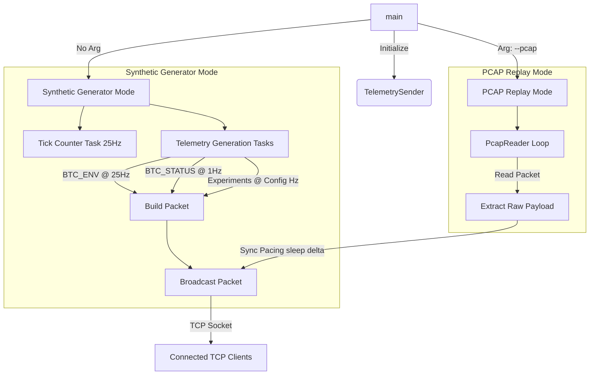

# Telemetry Sender Logic — Technical Specification

The `sender.py` script serves as the simulated Moraba ground station or flight computer, generating and distributing a Rexus-compliant telemetry downlink. It operates as an asynchronous TCP server, utilizing Python's standard `asyncio` framework to handle multiple telemetry stream frequencies and active clients concurrently, and supports PCAP replaying.

---

## 1. Architecture Overview

The sender is organized around a main class, `TelemetrySender`, which coordinates socket server execution, client connection pooling, data generation cadences, and packet serialization.



---

## 2. Execution Modes

### A. Synthetic Generator Mode (Default)
In this mode, the sender acts as the live flight telemetry compiler. 
1. **TCP Server Lifecycle**: Binds to `127.0.0.1:5000` via `asyncio.start_server()`. Whenever a client connects, it is registered in an internal connection pool (`self.clients: Set[asyncio.StreamWriter]`).
2. **Tick Counter**: A core background task updates `self.tick_counter` at exactly 25 Hz to simulate the flight computer's master clock cycle.
3. **Concurrent Data Streams**: An independent async loop is spawned for each payload type defined in the configuration. Each loop generates data at its respective target frequency (e.g., 25 Hz for environment data, 1 Hz for status reports) using `asyncio.sleep()`.
4. **Payload Generation**:
   - System payloads like `BTC_ENV` and `BTC_STATUS` are packed using Python's `struct` library to match C-struct binary footprints.
   - Experimental payloads are simulated with randomized byte arrays of matching sizes.

### B. PCAP Replay Mode (`--pcap`)
If launched with a PCAP path, the sender bypasses the synthetic generators:
1. **Extraction**: The script uses `scapy.all.PcapReader` to step through the file. It isolates packets containing a `Raw` payload layer.
2. **Timing Reconstruction**: For every packet, the script calculates the delta between its timestamp and the preceding packet's timestamp (`pkt.time - last_ts`). It calls `await asyncio.sleep(delta)` to pace transmission, ensuring the simulation behaves identically to the original physical flight network.
3. **Broadcasting**: The raw byte payloads are extracted and broadcast immediately to all connected clients.

---

## 3. Packet Construction and Serialization

The `build_packet` method constructs the raw telemetry frames according to the *THHOR-BOLT Downlink Packet Protocol Specification*. 

```
+------------------------------------------------------------------------------------+
|                                 Header (12 Bytes)                                  |
+---------+---------+---------+---------+---------+---------+-----------+------------+
| SYNC_0  | SYNC_1  | Version |  Type   | Sequence| Length  |   Tick    | Timestamp  |
| (0xB0)  | (0x17)  | (0x01)  | (uint8) | (uint8) | (uint8) | (uint16)  |  (uint32)  |
+---------+---------+---------+---------+---------+---------+-----------+------------+
|                                  Payload Data                                      |
+------------------------------------------------------------------------------------+
|                               0 to 50 Bytes of Data                                |
+------------------------------------------------------------------------------------+
|                                   CRC Checksum                                     |
+------------------------------------------------------------------------------------+
|                                2 Bytes (Big-Endian)                                |
+------------------------------------------------------------------------------------+
```

1. **Header Packing**: A 12-byte header is packed in **Little-Endian** format (`<BBBBBBHI`):
   - `sync[0]` (`0xB0`), `sync[1]` (`0x17`)
   - `version` (`0x01`)
   - `type` (Payload identifier)
   - `sequence` (Rolling per-type counter, wrapping at `255`)
   - `length` (Payload size)
   - `tick` (Current 16-bit master clock tick value)
   - `timestamp_us` (Microseconds elapsed since sender initialization)
2. **CRC-16 Computation**: 
   - A CRC-16-CCITT checksum is computed (using the polynomial `0x1021` and initial seed value `0xFFFF`).
   - The checksum covers all header and payload bytes *excluding* the two synchronization bytes (from byte offset 2 to the end of the payload).
3. **CRC Serialization**: The resulting 2-byte CRC integer is appended to the packet in **Big-Endian** order (`>H`) as specified by the protocol layout.
